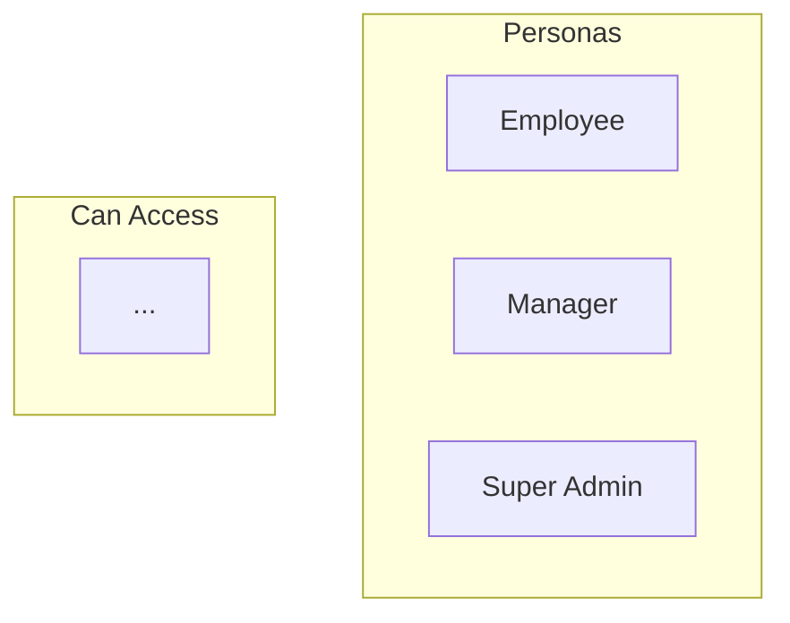
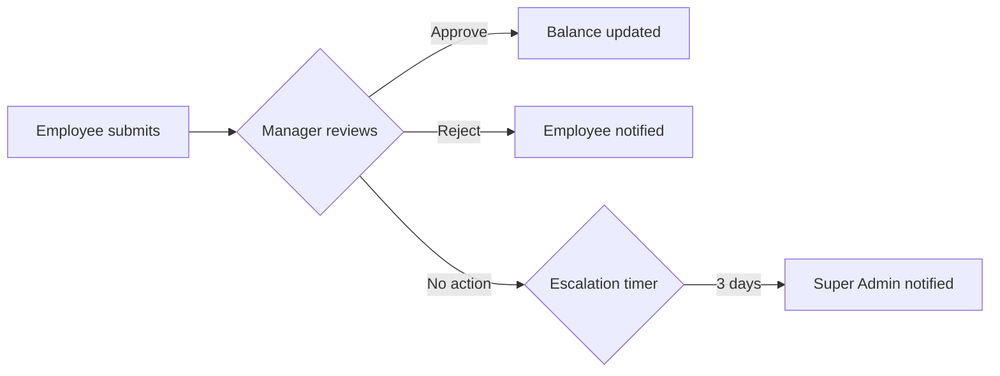
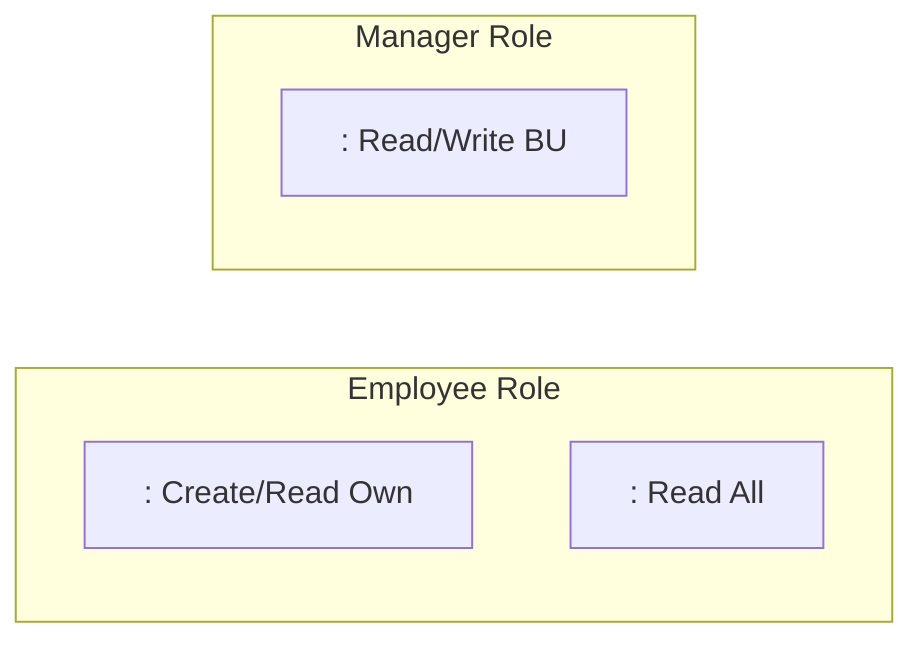
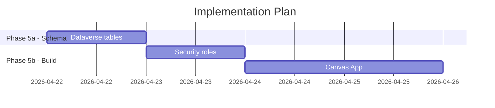

# /relay:visualise

When the user invokes this command:

1. Check which docs exist — only visualise what's available:
   - `docs/requirements.md` → personas + user story map
   - `docs/plan.md` → entity-relationship diagram + architecture + flows
   - `docs/security-design.md` → permission matrix + data flow
   - `docs/audit-report.md` → risk heatmap + checklist summary

2. Ask the user: "Do you want (A) just the diagrams in `docs/visuals.md`, or
   (B) a PowerPoint deck as well?"

---

## Output A — docs/visuals.md (Mermaid diagrams, always produced)

Produce a single `docs/visuals.md` file with all diagrams as Mermaid code
blocks. This file renders natively in GitHub, Azure DevOps, and VS Code with
the Mermaid extension.

### Diagram 1 — Persona & Trust Boundary Map (from requirements.md)


### Diagram 2 — Entity Relationship Diagram (from plan.md)
```mermaid
erDiagram
    LEAVE_REQUEST {
        autonumber cr_name
        choice cr_status
        ...
    }
    LEAVE_TYPE ||--o{ LEAVE_REQUEST : "type"
    ...
```

### Diagram 3 — Solution Architecture (from plan.md)
```mermaid
graph TB
    subgraph Canvas App
        scrHome[Home Dashboard]
        scrNew[New Request]
    end
    subgraph Dataverse
        T1[(<table_name>)]
        T2[(<table_name_2>)]
    end
    Canvas App --> Dataverse
```

### Diagram 4 — Approval Flow (from plan.md flows section)


### Diagram 5 — Security Permission Matrix (from security-design.md)


Or as a table if a matrix is clearer:

| Table | Employee | Manager | Super Admin |
|---|---|---|---|
| Leave Request | Create, Read Own | Read/Write BU | Full Org |
| Leave Type | Read | Read | Full CRUD |

### Diagram 6 — Phase Timeline (from plan.md)


---

## Output B — PowerPoint deck (if user selected option B)

Produce a PowerPoint file using the pptx skill with these slides:

1. **Title slide** — Project name, solution overview, date
2. **Problem statement** — What business problem this solves (from requirements.md context)
3. **Personas** — Who uses the system and what they need
4. **Solution overview** — Architecture diagram (embed from visuals.md)
5. **Data model** — Entity relationship diagram (embed or describe)
6. **Security design** — Permission matrix (table format)
7. **Implementation plan** — Phase breakdown with effort estimates from plan.md
8. **Open items** — Any DECISION NEEDED items or open questions
9. **Next steps** — What happens after this review

Read the pptx SKILL.md before generating the PowerPoint.

---

## After generating

Tell the user:
- `docs/visuals.md` is ready — renders in GitHub and VS Code (with Mermaid extension)
- If deck was generated: share the PowerPoint file link
- "To share with stakeholders: push to GitHub and share the link — the diagrams render automatically. Or open the PowerPoint and present directly."
